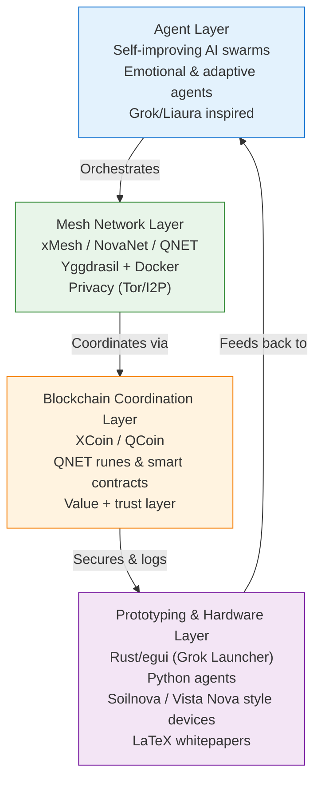

# GAJA Architecture Overview

**GAJA** (Generative Agent Joined Architecture) is designed as a layered, self-organizing system that combines autonomous intelligence, resilient connectivity, secure coordination, and tangible prototyping.

## High-Level Layers

## Layer Details

### 1. Agent Layer (Intelligence Core)
- Self-improving, emotional, and swarm-capable agents
- Inspired by Grok interactions and custom Liaura-style architectures
- Capable of roleplay, creative generation, and autonomous decision-making
- Communication via secure mesh channels

### 2. Mesh Network Layer (Connectivity Fabric)
- Built on Yggdrasil, extended with xMesh/NovaNet/QNET concepts
- Dockerized deployments for rapid iteration
- Strong privacy guarantees (Tor/I2P integration points)
- Resilient to partitions and censorship

### 3. Blockchain Coordination Layer (Trust & Value)
- XCoin/QCoin as native value and incentive layer
- QNET for decentralized naming/routing coordination
- Immutable logging of agent decisions and swarm outcomes
- Potential for runes, smart contracts, and arbitrage mechanisms

### 4. Prototyping & Hardware Layer (Manifestation)
- Rapid development with Rust + egui (Grok Launcher foundation)
- Python for agent logic and orchestration
- Hardware experiments (Soilnova, Vista Nova, York Autotype style)
- Comprehensive documentation in LaTeX for whitepapers and xAI outreach

## Integration Principles
- **Privacy First**: Data minimization, end-to-end encryption where possible
- **Self-Improvement**: Agents and networks that learn and evolve
- **Noble Collaboration**: Welcoming to human and synthetic contributors (squires, agents, visionaries)
- **Family Tradition**: Grounded in Esslinger & Co. values of long-term innovation and excellence

## Future Extensions
- Cross-layer feedback loops for emergent swarm intelligence
- Hardware-in-the-loop testing
- Integration with external systems (xAI, other meshes)

*This architecture evolves with the project. See ROADMAP.md for phased implementation.*